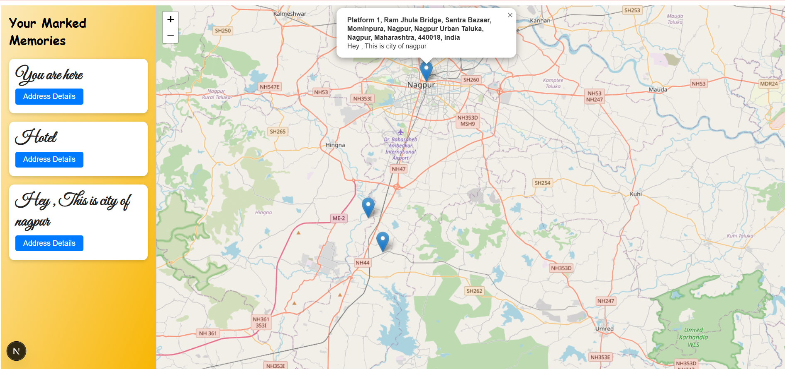

# 🗺️ InTandem

**InTandem** is a location-based React app where users can pin their current or custom locations on a map. The app persists pinned locations, displays nearby pins on page reload, and supports full backend integration with MongoDB and Node.js.

## 🚀 Features

- 🌍 Pin your current or custom location on the map
- 🔄 View all previously pinned locations even after refresh
- 📌 See only your pinned locations — no default or unwanted pins
- 🗃️ Persistent storage using MongoDB
- 🧭 Map integration using Leaflet.js
- ⚙️ Full MERN stack: MongoDB, Express, React, Node.js

---

## 📷 Screenshots



---

## 🛠️ Technologies Used

- **Frontend:** React.js, Leaflet.js
- **Backend:** Node.js, Express.js
- **Database:** MongoDB
- **Others:** dotenv, mongoose

---

## 🧑‍💻 Getting Started

### 1. Clone the repository

```bash
git clone https://github.com/Shrutis3004/InTandem.git
cd InTandem
